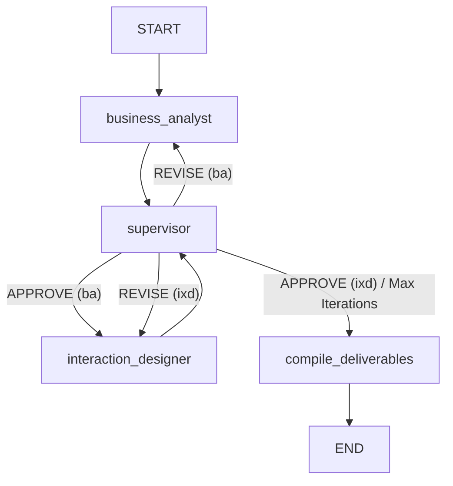

# Agentic AI for Automated Requirements Engineering: Methodology

> **MSc Dissertation Project — Lancaster University**
>
> This document describes the complete methodology for investigating how different agentic AI architectures perform automated Requirements Engineering (RE) from unstructured client briefs. It covers the research design, system architectures, datasets, prompt engineering strategy, evaluation framework, and technical implementation.

---

## Table of Contents

1. [Research Overview](#1-research-overview)
2. [Technology Stack](#2-technology-stack)
3. [Project Structure](#3-project-structure)
4. [Datasets](#4-datasets)
5. [Shared Infrastructure — Global Layer](#5-shared-infrastructure--global-layer)
6. [Architecture 1 — Single Agent](#6-architecture-1--single-agent)
7. [Architecture 2 — Supervisor-Worker](#7-architecture-2--supervisor-worker)
8. [Architecture 3 — Human-in-the-Loop (HITL)](#8-architecture-3--human-in-the-loop-hitl)
9. [Architecture 4 — Review-Critique (Self-Reflection)](#9-architecture-4--review-critique-self-reflection)
10. [Evaluation Framework](#10-evaluation-framework)
11. [Prompt Engineering Strategy](#11-prompt-engineering-strategy)
12. [Environment Configuration](#12-environment-configuration)
13. [Reproducibility and Running the Experiments](#13-reproducibility-and-running-the-experiments)

---

## 1. Research Overview

This project investigates whether agentic AI systems, built on Large Language Models (LLMs), can automate the Requirements Engineering process — transforming unstructured stakeholder briefs into structured, traceable, and standards-compliant software requirements specifications. The study implements and comparatively evaluates **four distinct multi-agent architectures**, each representing a different level of complexity and human involvement:

| # | Architecture | Key Characteristic |
|---|---|---|
| 1 | **Single Agent** | One autonomous agent handles the entire RE and Interaction Design (IxD) pipeline end-to-end using a ReAct tool-calling loop. |
| 2 | **Supervisor-Worker** | A supervisor agent orchestrates specialised worker agents (Business Analyst, Interaction Designer), evaluates their output, and iteratively requests revisions until quality thresholds are met. |
| 3 | **Human-in-the-Loop (HITL)** | A dispatcher agent delegates work to nine specialised subagents, with synchronous human intervention checkpoints for requirements elicitation, design preferences, and final sign-off. |
| 4 | **Review-Critique (Self-Reflection)** | A generator agent produces deliverables while a separate critique agent (using a different, more capable model) evaluates and triggers iterative revision loops. |

Each architecture processes the same input datasets and produces the same categories of output deliverables, enabling fair comparison through a unified evaluation framework.

### Deliverable Categories

All architectures produce the following artefacts:

1. **User Needs** (`UN-XXX`) — High-level stakeholder goals categorised by user group type (Overarching, Primary, Secondary) with demand levels and user journey context.
2. **Functional Requirements** (`FR-XXX`) — IEEE 830-compliant system behaviour specifications using mandatory "shall" phrasing.
3. **Non-Functional Requirements** (`NFR-XXX`) — Quality attributes covering performance SLAs, security, accessibility, GDPR compliance, reliability, and scalability.
4. **User Stories** (`US-XXX`) — Agile user stories in the format "As a [role], I want [goal] so that [benefit]" with Gherkin-style `Given-When-Then` acceptance criteria.
5. **Traceability Matrix & Gap Analysis** — Mapping from User Needs → FRs/NFRs → User Stories, plus identification of gaps and BA recommendations.
6. **HTML UI Mockups** — Self-contained, responsive HTML5 wireframes with multi-state side-by-side layouts (Populated, Empty, Error/Offline states) using CSS Grid.
7. **Interaction Design Documentation** — User Story-to-screen mapping tables, UI/UX trade-off decisions, and design rationale.

---

## 2. Technology Stack

### Core Framework

| Component | Technology | Version |
|---|---|---|
| Agent Orchestration | [LangGraph](https://github.com/langchain-ai/langgraph) | 1.2.1 |
| LLM Integration | [LangChain](https://github.com/langchain-ai/langchain) | 1.3.1 |
| Language | Python | 3.x |
| Package Management | pip / setuptools | — |

### LLM Providers and Models

The project uses **Azure OpenAI Service** as the primary LLM provider, accessed through `langchain_openai.ChatOpenAI`. The system supports configurable model selection via environment variables:

| Variable | Purpose | Default Model |
|---|---|---|
| `MODEL` | Primary generator model for all agent architectures | `gpt-5.4` |
| `EVAL_MODEL` | Evaluation and critique model (used in Review-Critique and evaluation framework) | `gpt-5.5` |

Additionally, the `llm_client.py` factory supports:
- **Azure OpenAI** (primary, via model-router deployment)
- **OpenAI** (fallback)
- **Anthropic** (Claude 3.5 Sonnet)
- **Google** (Gemini 2.0 Flash)

All generation uses `temperature=0` for deterministic, reproducible outputs with token streaming enabled (`streaming=True`, `stream_usage=True`).

### Vector Database (RAG)

| Component | Technology | Details |
|---|---|---|
| Vector Store | [Pinecone](https://www.pinecone.io/) | Index: `obsidian-rag` |
| Embedding Model | Azure OpenAI `text-embedding-3-small` | Via `AzureClient.ChatClient` |

### Evaluation Libraries

| Library | Purpose |
|---|---|
| [DeepEval](https://github.com/confident-ai/deepeval) | G-Eval metric framework for LLM-based evaluation |
| [scikit-learn](https://scikit-learn.org/) | Cosine similarity computation for embedding coverage |
| [Playwright](https://playwright.dev/) + [axe-core](https://github.com/dequelabs/axe-core) | Automated HTML accessibility (WCAG) auditing |
| [Matplotlib](https://matplotlib.org/) | Visualisation of comparison charts |
| [pandas](https://pandas.pydata.org/) | Data aggregation and tabular analysis |
| [pytest](https://pytest.org/) | Test framework for evaluation validation |

### Observability

| Service | Purpose |
|---|---|
| [LangSmith](https://smith.langchain.com/) | LLM call tracing, latency monitoring, token usage tracking |

---

## 3. Project Structure

```
MSc Project/
├── Data/                          # Input datasets (client briefs + ground truth)
│   ├── requirements.md            # Dataset 1: LiveFootball App (unstructured brief)
│   ├── functional_requirements.json
│   ├── non_functional_requirements.json
│   ├── dataset2/                  # Dataset 2: Clean Air Zone Service
│   │   ├── requirements.md
│   │   └── requirements.json
│   └── dataset3/                  # Dataset 3: DigitalHome Smart House SRS
│       └── 2010 - home 1.3.pdf
│
├── global_layer/                  # Shared infrastructure (LLM clients, state, utilities)
│   ├── AzureClient.py             # Azure OpenAI wrapper + embedding client
│   ├── PineconeClient.py          # Pinecone vector DB client
│   ├── llm_client.py              # LLM factory (multi-provider, test mode, streaming)
│   ├── ba_state.py                # Pydantic schemas for BA pipeline output
│   ├── ixd_state.py               # Pydantic schemas for IxD pipeline output
│   └── functions.py               # Shared I/O, file formatters, graph visualiser, deliverable compiler
│
├── single_agent/                  # Architecture 1: Single autonomous agent
│   ├── main.py                    # LangGraph agent pipeline factory
│   ├── run.py                     # CLI runner with live event streaming
│   ├── tools.py                   # Tools: save_report_file, save_html_mockup, read_file
│   ├── prompts/
│   │   └── single_agent_master.md # Unified system prompt (11 KB)
│   └── outputs/                   # Run outputs (avg_run_1, demo, final_run, gpt-5.5, etc.)
│
├── supervisor_worker/             # Architecture 2: Supervisor-Worker pattern
│   ├── main.py                    # StateGraph with supervisor routing
│   ├── run.py                     # CLI runner
│   ├── agents/
│   │   ├── business_analyst.py    # BA worker node
│   │   ├── interaction_designer.py# IxD worker node
│   │   ├── supervisor.py          # Supervisor evaluator node
│   │   ├── routing.py             # Deterministic state-based router
│   │   └── compile_deliverables.py# Terminal deliverable packager
│   ├── local_states/              # Worker-scoped state definitions
│   ├── prompts/                   # Per-agent prompt templates
│   └── outputs/                   # Run outputs (final_run, gpt_5.4)
│
├── hitl_agent/                    # Architecture 3: Human-in-the-Loop
│   ├── main.py                    # Dispatcher agent pipeline factory
│   ├── run.py                     # CLI runner with human interrupt handling
│   ├── tools.py                   # Dispatcher + interactive tools (ask_stakeholder)
│   ├── subagents/                 # 9 specialised subagent modules
│   │   ├── elicitation.py         # Requirements elicitation (HITL Q&A)
│   │   ├── user_needs.py          # User Needs extraction
│   │   ├── functional_requirements.py
│   │   ├── non_functional_requirements.py
│   │   ├── user_stories.py        # Agile User Stories with Gherkin AC
│   │   ├── re_validation.py       # RE deliverable auditor
│   │   ├── design_elicitation.py  # UI/UX preference elicitation (HITL Q&A)
│   │   ├── interaction_designer.py# HTML mockup generator
│   │   └── feedback.py            # Final stakeholder review (HITL sign-off)
│   ├── prompts/                   # 10 prompt templates (one per subagent + dispatcher)
│   └── outputs/                   # Run outputs
│
├── review_critique/               # Architecture 4: Self-Reflection (Review-Critique)
│   ├── main.py                    # StateGraph pipeline (generator → critique loop)
│   ├── run.py                     # CLI runner
│   ├── subagents/
│   │   ├── business_analyst.py    # Generator + Critique subagent pair
│   │   └── interaction_designer.py# Generator + Critique subagent pair
│   ├── prompts/                   # Generator + Critique + Supervisor prompts
│   └── outputs/                   # Run outputs
│
├── evaluation/                    # Unified evaluation framework
│   ├── run.py                     # Main evaluation orchestrator (CLI)
│   ├── confusion_matrix.py        # Embedding-based cosine similarity coverage
│   ├── llm_judge.py               # LLM-as-Judge for coverage + INVEST evaluation
│   ├── html_evals.py              # Playwright + Axe WCAG accessibility audit
│   ├── visualize_metrics.py       # Matplotlib comparison charts + summary tables
│   ├── geval/                     # DeepEval G-Eval integration
│   │   ├── metrics.py             # Functional & Non-Functional GEval metrics
│   │   ├── azure_model.py         # DeepEvalBaseLLM wrapper for Azure OpenAI
│   │   ├── run_geval.py           # Standalone GEval CLI runner
│   │   └── test_requirements_geval.py # Pytest test suite
│   ├── prompts/                   # Evaluation prompt templates
│   │   ├── requirements_evaluator.md  # LLM Judge coverage prompt
│   │   ├── invest_evaluator.md    # INVEST rubric prompt
│   │   └── iso_29148_auditor.md   # ISO 29148 quality audit prompt
│   ├── state/
│   │   └── llm_judge_state.py     # Pydantic schemas for structured eval outputs
│   └── evals/                     # Per-agent evaluation results (JSON, CSV, PNG charts)
│
├── tests/
│   └── test_evaluation_v2.py      # Pytest tests for deterministic evaluation functions
│
├── langgraph.json                 # LangGraph deployment graph registry
├── pyproject.toml                 # Python package configuration
├── requirements.txt               # 220 pinned dependencies
└── .env                           # Environment variables (API keys, model config)
```

---

## 4. Datasets

Three distinct datasets are used, each representing a different problem domain and input format. This diversity tests each architecture's ability to generalise across varying levels of input structure and complexity.

### Dataset 1 — LiveFootball Mobile Application

- **Domain**: Mobile sports entertainment application
- **Input Format**: Unstructured prose document (`requirements.md`, 3.5 KB)
- **Description**: A product vision document describing features for a football fan app including live ticker results, league tables, live stream links (DAZN/Sky), push notifications, social media sharing, user registration, and content management.
- **Ground Truth**: 15 functional requirements and 20 non-functional requirements (categorised as Property, Environment, or Process type). Covers broadcasting rights compliance, GDPR, concurrent user scaling (100,000 users), offline reliability, startup performance (≤ 2 seconds), and post-release support processes.

### Dataset 2 — Clean Air Zone Service (CAZS)

- **Domain**: UK Government / DVLA vehicle compliance and charging system
- **Input Format**: Semi-structured Markdown (`requirements.md`) organised into 13 user journeys with "I need to..." / "So that..." patterns and user quotes. Also includes a JSON file (`requirements.json`) with 13 requirement statements.
- **Description**: A GOV.UK-style digital service for checking vehicle compliance with Clean Air Zones, making payments, managing exemptions, handling Penalty Charge Notices (PCNs), and signposting to Local Authority services.

### Dataset 3 — DigitalHome Smart House Management System

- **Domain**: Smart home automation system by HomeOwner Inc.
- **Input Format**: Formal IEEE 830-style Software Requirements Specification (SRS v1.3, 15-page PDF)
- **Description**: A comprehensive SRS document including change history, team project schedule, product scope, user descriptions (General User, Master User, DH Technician), operational environment (home web server, wireless gateway, sensors/controllers), and detailed functional requirements (thermostat control 60°F–80°F, humidistat 30%–60% RH, security contact sensors up to 50 units, appliance switches up to 100 units, monthly planner/reports) and non-functional requirements (performance SLAs, ≤ 2s UI updates, ≥ 10 Hz sensor acquisition, 1000 ft wireless range, TLS encryption, IEEE 830/1008/1016/1028 compliance).

### Ground Truth Construction

Ground truth requirements for evaluation are stored as structured JSON files in `Data/functional_requirements.json` and `Data/non_functional_requirements.json`. Each ground truth requirement is a dictionary containing:

```json
{
  "No.": 1,
  "Requirement": "The app shall allow users to select and follow their favourite football teams...",
  "Type": "Property"  // (non-functional only)
}
```

These serve as the benchmark against which all agent-generated requirements are compared during evaluation.

---

## 5. Shared Infrastructure — Global Layer

The `global_layer/` package provides shared infrastructure used by all four architectures, ensuring consistency across experiments.

### 5.1 LLM Client Factory (`llm_client.py`)

The `get_llm()` function creates LangChain `ChatOpenAI` instances configured for Azure OpenAI:

- **Default model**: Reads from `MODEL` environment variable (default: `gpt-4.1`/`gpt-5.4`)
- **Temperature**: `0` (deterministic generation)
- **Streaming**: Enabled with `stream_usage=True` for real-time token metric capture
- **Test mode**: When `test=True`, returns a `GenericFakeChatModel` that yields canned responses, allowing unit testing without API calls

The `stream_llm()` function provides real-time token streaming to stdout, printing tokens as they arrive and accumulating the full response.

### 5.2 Azure OpenAI Client (`AzureClient.py`)

A lightweight wrapper around `openai.OpenAI` for:
- **Embedding generation**: `create_embedding(text, model="text-embedding-3-small")` — used throughout the evaluation framework for cosine similarity calculations
- **SSL configuration**: Disables SSL verification via `httpx.Client(verify=False)` for local proxy environments

### 5.3 Pinecone Vector Client (`PineconeClient.py`)

Connects to a Pinecone vector index (`obsidian-rag`) for Retrieval-Augmented Generation (RAG):
- Retrieves semantically similar past requirements examples based on embedded client briefs
- Namespace-scoped queries for project isolation
- Used by architectures that incorporate RAG to augment generation prompts with relevant historical examples

### 5.4 State Schemas

#### Business Analyst State (`ba_state.py`)

Defines a **7-phase RE pipeline** using Pydantic `BaseModel` classes:

| Phase | Schema | ID Convention | Key Fields |
|---|---|---|---|
| 1 | `UserNeed` | `UN-XXX` | `user_group_type` (Overarching/Primary/Secondary), `demand` (High/Medium/Low), `user_journey` |
| 2 | `FunctionalRequirement` | `FR-XXX` | `requirement` (mandatory "shall"), `source` (trace to UN), `priority` |
| 3 | `NonFunctionalRequirement` | `NFR-XXX` | `requirement`, `source`, `priority` |
| 4 | `UserStory` | `US-XXX` | `user_story` (As a.../I want.../So that...), `acceptance_criteria` (list of `_Scenario` with Given/When/Then) |
| 5 | `TraceabilityEntry` | — | `user_need_id` → `derived_requirement_ids` → `mapped_user_story_ids` |
| 6 | `GapRecommendation` | — | `title`, `observation`, `recommendation` |
| 7 | `SummaryStatistics` | — | Totals, `priority_breakdown`, `user_needs_coverage` |

The master container `RequirementsPipelineOutput` aggregates all phases into a single structured output.

#### Interaction Design State (`ixd_state.py`)

Defines structured outputs for the IxD phase:

- `MappingTable`: Maps HTML files → User Stories → UI Visualisations
- `TradeoffTable`: Records UI/UX design decisions and rationale
- `HtmlMockupFiles`: Contains `html_filename` and `html_content` (raw HTML with inline CSS)
- Master container: `IxdPipelineOutput`

### 5.5 Shared Utility Functions (`functions.py`)

| Function | Purpose |
|---|---|
| `_read_file(filepath)` | Safe UTF-8 file reader with error handling |
| `_write_json_file(filepath, content)` | Serialises Pydantic models/dicts to JSON, strips markdown fences |
| `_draw_graph(graph, output_path)` | Visualises LangGraph workflows as PNG using Mermaid |
| `_data_file(filepath)` | Loads raw input requirements from `Data/requirements.md` |
| `_save__requirement_files(response, output_dir)` | Decomposes BA output into 5 structured Markdown files |
| `_save_ixd_files(ixd_output, output_dir)` | Saves HTML mockups to `html/` and creates design notes |
| `_compile_deliverables(state, architecture_name)` | Packages final deliverables into `final_deliverables/INDEX.md` |
| `token_counter(response, agent_name)` | Extracts and prints `input_tokens`, `output_tokens`, `total_tokens` |

---

## 6. Architecture 1 — Single Agent

### 6.1 Design Pattern

The single agent architecture consolidates the entire end-to-end Business Analysis and Interaction Design pipeline into **one autonomous agent** using LangGraph's `create_agent()` function. The agent operates in a **ReAct (Reasoning + Acting) loop**: it performs Chain-of-Thought (CoT) reasoning, decides which tool to call, observes the tool output, and continues reasoning until all deliverables are produced.

### 6.2 Graph Structure

```
START → Agent Node (LLM + System Prompt) ⇄ Tool Node (save_report_file / save_html_mockup / read_file) → END
```

The graph has only two nodes:
1. **Agent Node**: The LLM with the unified system prompt, performing CoT reasoning and tool-call decisions
2. **Tool Node**: Wraps the three available tools for file I/O

The agent loops between these nodes until all deliverables are saved, then emits its final response and the graph terminates.

### 6.3 System Prompt

A single comprehensive prompt (`single_agent_master.md`, 11 KB / 224 lines) defines the agent's persona as a **Lead Systems Architect & Business Analysis Specialist**. Key sections:

- **Core Goal**: Analyse raw inputs, discover User Needs, engineer FRs/NFRs, derive User Stories, generate HTML mockups, and compile an executive index
- **ID Conventions**: `UN-XXX`, `FR-XXX`, `NFR-XXX`, `US-XXX` with MoSCoW prioritisation
- **Granularity Guardrails**: Explicit rules preventing over-fragmentation into form-field micro-steps or speculative unrequested administrative workflows
- **HTML Mockup Specification**: CSS Grid layout (`div.wrap` → `div.grid` → `div.phone` → `div.screen`) rendering 3 side-by-side states per screen
- **Execution Protocol**: Step 0 (mandatory CoT in `<thought>` blocks) → Step 1 (audit report) → Step 2 (BA deliverables) → Step 3 (HTML mockups) → Step 4 (INDEX.md)

### 6.4 Tools

| Tool | Parameters | Purpose |
|---|---|---|
| `save_report_file` | `filename`, `report_markdown`, `output_dir` | Writes Markdown deliverables to the output directory |
| `save_html_mockup` | `filename`, `html_content`, `output_dir` | Writes HTML5 wireframes into `{output_dir}/html/` |
| `read_file` | `filename`, `output_dir` | Reads previously saved files for cross-referencing or validation |

### 6.5 Execution Flow

1. Raw input text is loaded from `Data/requirements.md` via `_data_file()`
2. A `HumanMessage` is constructed with the input text and target output directory
3. The graph streams execution events (`pipeline.stream_events(version="v3")`)
4. The agent uses CoT reasoning to determine the sequence of deliverables
5. Tool calls write each deliverable to disk
6. Token metrics are accumulated from `usage_metadata` across all messages
7. Execution state is persisted to `state.json`

### 6.6 Configuration

- **Recursion Limit**: 50 (maximum tool-call iterations)
- **CLI Arguments**: `--output-dir` (session name), `--thread-id` (checkpoint ID)
- **Checkpointer**: `InMemorySaver()` for graph state persistence

### 6.7 Output Structure

```
outputs/{session}/
├── initial_audit_report.md
├── 01_user_needs.md
├── 02_functional_requirements.md
├── 03_non_functional_requirements.md
├── 04_user_stories.md
├── 05_summary_and_traceability.md
├── 07_ui_mockups_and_interaction_design.md
├── INDEX.md
├── state.json
└── html/
    ├── login.html
    ├── dashboard.html
    └── ...
```

---

## 7. Architecture 2 — Supervisor-Worker

### 7.1 Design Pattern

The supervisor-worker architecture implements an **Evaluator-Optimizer Multi-Agent Pattern**. A central **Supervisor** agent acts as a quality gatekeeper, auditing worker outputs against domain-specific rubrics and deciding whether to approve (`APPROVE`) or request targeted revisions (`REVISE`). Specialist **Worker** agents focus exclusively on generation, while the Supervisor handles all quality evaluation.

### 7.2 Graph Structure



The workflow is divided into two sequential **phases**:
- **Phase 1 — Business Analysis (`ba`)**: Raw input → User Needs, FRs, NFRs, User Stories, Traceability, Gap Analysis
- **Phase 2 — Interaction Design (`ixd`)**: Approved User Stories → HTML mockups, mapping tables, trade-off decisions

### 7.3 Worker Agents

| Agent | Role | Pydantic Output Schema | Key Behaviour |
|---|---|---|---|
| **Business Analyst** | Generates structured RE artefacts | `RequirementsPipelineOutput` | During revision, receives previous output + supervisor critique; performs surgical in-place patches on flagged items while preserving approved ones |
| **Interaction Designer** | Generates HTML wireframes from approved user stories | `IxdPipelineOutput` | Enforces multi-state screen layouts (Populated, Empty, Error/Offline) in CSS Grid |
| **Supervisor** | Quality assurance evaluator | `SupervisorReview` | Phase-aware evaluation using different prompts for BA vs IxD; scores 1–5, verdicts APPROVE/REVISE |
| **Compile Deliverables** | Terminal packager | — | Invokes `_compile_deliverables()` to create `final_deliverables/INDEX.md` |

### 7.4 Supervisor Evaluation

The Supervisor uses a `SupervisorReview` Pydantic schema:

```python
class SupervisorReview:
    verdict: "APPROVE" | "REVISE"
    score: int          # 1 to 5
    phase: "ba" | "ixd" | "END"
    issues: List[str]   # Specific flagged item IDs (e.g., "US-003", "FR-001")
    feedback: str       # Detailed actionable guidance
```

A phase-specific evaluation config (`EVAL_CONFIG`) selects different prompts depending on the current phase:
- `ba` phase: Evaluates raw input against generated BA deliverables
- `ixd` phase: Evaluates approved user stories against generated HTML mockups

### 7.5 Routing Logic

Routing is **deterministic** — implemented in pure Python (`agents/routing.py`) rather than through an LLM call, eliminating unnecessary latency:

1. **Safety Valve**: If `current_iteration >= max_iterations_per_phase` (default: 3), forces forward progress to prevent infinite loops
2. **Phase Routing**:
   - `ba` + `REVISE` → `business_analyst`
   - `ba` + `APPROVE` → `interaction_designer`
   - `ixd` + `REVISE` → `interaction_designer`
   - `ixd` + `APPROVE` → `compile_deliverables`
3. **Completion**: If `phase in ("END", "completed")` → `compile_deliverables`

### 7.6 State Management

The architecture uses a centralised `AgentState(TypedDict)`:

| Field | Type | Purpose |
|---|---|---|
| `messages` | `List[AnyMessage]` | Accumulated message history (reducer: `operator.add`) |
| `ba_output` | `Optional[dict]` | Dict dump of `RequirementsPipelineOutput` |
| `ixd_output` | `Optional[dict]` | Dict dump of `IxdPipelineOutput` |
| `supervisor_feedback` | `Optional[str]` | Current critique for the active worker |
| `feedback_history` | `List[dict]` | Log of all supervisor reviews (reducer: `operator.add`) |
| `phase` | `Literal["ba", "ixd", "completed", "END"]` | Current pipeline phase |
| `iterations` | `Dict[str, int]` | Per-phase iteration counters (`{"ba": 0, "ixd": 0}`) |
| `max_iterations_per_phase` | `int` | Safety valve limit (default: 3) |
| `verdict` | `Optional[str]` | `"APPROVE"` or `"REVISE"` |
| `input_tokens`, `output_tokens`, `total_tokens` | `int` | Token usage accumulators (reducer: `operator.add`) |

### 7.7 Output Structure

```
outputs/{session}/
├── 01_business_analysis/
│   ├── iter_0/
│   │   ├── 01_user_needs.md ... 05_analysis_summary.md
│   │   └── supervisor_review.md
│   └── iter_1/ (if revision required)
├── 02_interaction_design/
│   ├── iter_0/
│   │   ├── html/*.html
│   │   ├── ixd_design_notes.md
│   │   └── supervisor_review.md
│   └── iter_1/
├── final_deliverables/
│   ├── INDEX.md
│   └── mockups/
└── state.json
```

---

## 8. Architecture 3 — Human-in-the-Loop (HITL)

### 8.1 Design Pattern

The HITL architecture implements a **Hierarchical Dispatcher-Subagent Pattern with Synchronous Human Intervention**. A central **Task Dispatcher Agent** performs CoT reasoning to determine task dependencies and sequentially dispatches work to **nine specialised subagents**. Three of these subagents include interactive CLI-based human intervention points where the system pauses execution and collects stakeholder input.

### 8.2 Graph Structure

```
START → Task_Dispatcher_Agent (LLM + CoT reasoning)
  ├── tool: task("elicitation", ...)          ← HITL: ask_stakeholder (CLI Q&A)
  ├── tool: task("user_needs", ...)
  ├── tool: task("functional_requirements", ...)
  ├── tool: task("non_functional_requirements", ...)
  ├── tool: task("user_stories", ...)
  ├── tool: task("re_validation", ...)         ← Automated quality audit
  ├── tool: task("design_elicitation", ...)    ← HITL: ask_stakeholder (design prefs)
  ├── tool: task("interaction_designer", ...)
  └── tool: task("feedback", ...)              ← HITL: ask_stakeholder_feedback (sign-off)
→ END
```

The Dispatcher itself operates as a standard LangGraph `create_agent()` loop: it reasons about task dependencies, calls the `task()` tool to dispatch work, observes the result, and decides the next step.

### 8.3 Subagent Registry

| # | Subagent | Prompt Template | Output Artefact | Type |
|---|---|---|---|---|
| 1 | `elicitation` | `questioner.md` | `01_elicitation_report.md` | **HITL** — Asks 3–5 clarifying questions via CLI |
| 2 | `user_needs` | `user_needs.md` | `02_user_needs_report.md` | Autonomous |
| 3 | `functional_requirements` | `functional_requirements.md` | `03_functional_requirements.md` | Autonomous |
| 4 | `non_functional_requirements` | `non_functional_requirements.md` | `04_non_functional_requirements.md` | Autonomous |
| 5 | `user_stories` | `user_stories.md` | `05_user_stories.md` | Autonomous |
| 6 | `re_validation` | `re_validation.md` | `re_validation_report.md` | Autonomous — audits deliverables 01–05 |
| 7 | `design_elicitation` | `design_elicitation.md` | `06_design_requirements.md` | **HITL** — Asks UI preference questions |
| 8 | `interaction_designer` | `interaction_designer.md` | `07_ui_mockups.md` + `html/*.html` | Autonomous |
| 9 | `feedback` | `feedback.md` | `08_feedback_report.md` | **HITL** — Final stakeholder review |

### 8.4 Human Intervention Points

There are **three distinct synchronous human intervention points**:

1. **Requirements Elicitation** (`ask_stakeholder`):
   - **Trigger**: When the elicitation subagent identifies scope ambiguities or vague business rules
   - **Behaviour**: CLI prints `[?] ELICITATION AGENT CLARIFICATION TOOL CALL` with `Question` and `Context/Rationale`, then blocks on `input()`
   - **Fallback**: If stakeholder presses Enter (empty input), records: *"No specific preference provided; use standard domain defaults."*

2. **Design Elicitation** (`ask_stakeholder`):
   - **Trigger**: When the design elicitation subagent queries visual preferences (colour themes, light/dark mode, typography, layout style)
   - **Behaviour**: CLI prints `[?] DESIGN ELICITATION AGENT CLARIFICATION TOOL CALL`, blocks on `input()`
   - **Fallback**: Records: *"No specific preference provided; use standard modern UI defaults."*

3. **Final Review & Sign-Off** (`ask_stakeholder_feedback`):
   - **Trigger**: After all deliverables (01–07 + HTML mockups) are built
   - **Behaviour**: CLI presents completed deliverables for review, asks for change requests
   - **Action**: If changes are provided, the feedback subagent calls `update_deliverable_file()` to modify target files before compiling the feedback report
   - **Fallback**: Records: *"No changes requested; deliverables package approved as presented."*

### 8.5 Programmatic Deliverable Verification

After each subagent invocation completes, the `task()` tool programmatically verifies that the expected output file exists on disk (using the `EXPECTED_OUTPUT_FILES` mapping). If a file was not created, an explicit failure message is returned to the Dispatcher, forcing a retry.

### 8.6 Token Metric Tracking

Token usage is tracked at two levels:
- **Dispatcher tokens**: Extracted from `usage_metadata` on each message in the main graph
- **Subagent tokens**: Accumulated in a global `SUBAGENT_TOKENS` dictionary during each `task.invoke()` call

Both are combined in the final `state.json` output.

### 8.7 Accessibility Testing

The `test.py` file uses **Playwright** and **axe-playwright-python** (`Axe()`) to perform automated WCAG accessibility audit scans on the rendered HTML mockup output files.

---

## 9. Architecture 4 — Review-Critique (Self-Reflection)

### 9.1 Design Pattern

The review-critique architecture implements an **automated self-reflection pattern** using distinct **generator** and **evaluator** model pairings. A generator subagent produces deliverables, then a separate critique subagent (optionally using a more capable model) evaluates the output against quality rubrics. If the critique identifies issues, the generator revises its work in a targeted loop. This pattern is applied independently for both the BA and IxD phases.

### 9.2 Graph Structure

```
START → business_analyst_node → interaction_designer_node → END
```

Each node internally runs a **generator–critique loop**:

```
                  ┌───────────────────────┐
                  │  Generate BA Draft    │
                  │  (01 to 05 files)     │
                  └──────────┬────────────┘
                             │
                             ▼
                  ┌───────────────────────┐
                  │  Run BA Critique      │
                  │  (06_review_summary)  │
                  └──────────┬────────────┘
                             │
                   ┌─────────┴─────────┐
                   ▼                   ▼
              Approved?           Not Approved
              (Score 4–5)         (Score 1–3)
                   │                   │
                   ▼                   ▼
        Proceed to IxD        Revise BA Draft
                               (Surgical patch)
                                     │
                                     └─── Loop (max 3 rounds)
```

The same loop structure repeats for the Interaction Design phase.

### 9.3 Dual-Model Strategy

A distinguishing feature of this architecture is the use of **two different LLM models**:

| Role | Model (env var) | Purpose |
|---|---|---|
| Generator | `MODEL` (e.g., `gpt-5.4`) | Produces the RE and IxD deliverables |
| Evaluator/Critique | `EVAL_MODEL` (e.g., `gpt-5.5`) | Evaluates deliverable quality, identifies gaps, scores 1–5 |

This separation allows the evaluator to potentially use a more capable (or differently tuned) model than the generator, testing whether asymmetric model pairing improves output quality.

### 9.4 Critique Agent Behaviour

The critique agent (`ba_critique.md` prompt) is defined as a **Senior Quality-Assurance Reviewer** that:

1. Reads all generated deliverables (01–05) using the `read_file` tool
2. Evaluates against a checklist covering completeness, traceability, granularity, testability, consistency, acceptance criteria quality, and prioritisation
3. **Scores** on a 1–5 scale:
   - **5**: Meets all criteria; no notable gaps
   - **4**: Meets all criteria; minor stylistic notes only
   - **3**: One or two fixable gaps; otherwise sound
   - **2**: Multiple gaps or structural problems
   - **1**: Fundamentally incomplete or unusable
4. **Decision**: Score ≥ 4 → `APPROVED`; Score ≤ 3 → `REVISE` with specific flagged items
5. Saves `06_review_summary.md` with verdict, score, identified issues, and suggested fixes

### 9.5 Surgical Revision

When a revision is triggered:
1. The generator agent reads the review summary (`06_review_summary.md`) using the `read_file` tool
2. It loads affected deliverable files
3. It patches **only** flagged items while preserving approved content
4. It updates files via `save_report_file` / `save_html_mockup`

### 9.6 Scope Boundaries

The architecture enforces strict scope boundaries:
- The **BA critique** agent is explicitly instructed to focus ONLY on business analysis deliverables (01–05) and must NOT check for, demand, or flag missing HTML mockups or wireframes — these are handled downstream by the IxD pipeline
- The **IxD critique** agent evaluates both user stories (04) and HTML mockups

### 9.7 Automated Termination

Loops terminate when:
1. The string `"approved"` is detected in the evaluator's output, **OR**
2. `max_rounds` (default: 3) is reached

### 9.8 State Management

The `PipelineState(TypedDict)` tracks:
- `messages`, `output_dir`
- Separate token counters for generator vs evaluator: `generator_input_tokens`, `generator_output_tokens`, `eval_input_tokens`, `eval_output_tokens`
- Combined totals: `input_tokens`, `output_tokens`, `total_tokens`

This separation enables analysis of the computational overhead introduced by the critique loop.

---

## 10. Evaluation Framework

The evaluation framework provides a **multi-faceted benchmarking suite** for comparing agent-generated requirements against ground truth. It combines embedding-based similarity, LLM-as-a-Judge, standards compliance auditing, Agile quality rubrics, automated accessibility testing, and the DeepEval G-Eval framework.

### 10.1 Evaluation Pipeline

The main evaluation orchestrator (`evaluation/run.py`) runs the full pipeline via CLI:

```bash
python -m evaluation.run --agent hitl \
    --func-reqs hitl_agent/outputs/final_run/03_functional_requirements.md \
    --nfunc-reqs hitl_agent/outputs/final_run/04_non_functional_requirements.md \
    [--user-stories hitl_agent/outputs/final_run/05_user_stories.md] \
    [--html-dir hitl_agent/outputs/final_run/html] \
    [--model gpt-4.1]
```

Each evaluation step can be toggled via CLI flags: `--skip-coverage`, `--skip-llm-judge`, `--skip-iso-audit`, `--skip-invest-eval`, `--skip-html-eval`.

### 10.2 Evaluation Metrics

#### Metric 1 — Embedding Coverage (Cosine Similarity)

- **File**: `confusion_matrix.py`
- **Method**: Embeds both ground truth and generated requirements using Azure OpenAI `text-embedding-3-small`. Computes a cosine similarity matrix $S \in \mathbb{R}^{M \times N}$ where $M$ = number of ground truth requirements and $N$ = number of generated requirements. For each ground truth item, retrieves the top-$k$ (default $k=2$) most similar generated requirements.
- **Coverage Classification**:
  - Max similarity score $\geq 0.70$ → `full_coverage`
  - $0.60 \leq$ score $< 0.70$ → `partial_coverage`
  - Score $< 0.60$ → `no_coverage`
- **Output**: Per-requirement coverage scores with matched generated requirements, saved as JSON and CSV ratio table

#### Metric 2 — LLM-as-a-Judge Coverage

- **File**: `llm_judge.py`
- **Method**: An LLM evaluator (default: `gpt-4.1`, configurable via `EVAL_MODEL`) compares generated requirements against ground truth using the `requirements_evaluator.md` prompt. It identifies semantic matches, handles split coverage (where one ground truth requirement maps to multiple generated ones), and recognises domain equivalence independent of syntactic wording.
- **Output Schema** (`GroundTruthCoverageList`):
  - Per ground truth item: `matched_generated_requirements` (list), `coverage_verdict` (`FULL` / `PARTIAL` / `NONE`), `reasoning`
- **Key Feature**: Uses OpenAI's structured output API (`client.responses.parse(text_format=GroundTruthCoverageList)`) to guarantee deterministic JSON output matching the Pydantic schema

#### Metric 3 — INVEST User Story Quality

- **File**: `llm_judge.py` → `evaluate_invest_user_stories()`
- **Prompt**: `invest_evaluator.md`
- **Method**: Evaluates each User Story against the six INVEST criteria:

| Criterion | Score 1.0 | Score 0.5 | Score 0.0 |
|---|---|---|---|
| **I**ndependent | Self-contained capability | Partial dependency | Tightly coupled |
| **N**egotiable | Expresses intent, not implementation | Mixed | Prescribes specific UI/DB details |
| **V**aluable | Clear user/business benefit | Implied benefit | No articulated benefit |
| **E**stimable | Bounded scope + explicit AC | Partially scoped | Unbounded or vague |
| **S**mall | Single sprint-sized | Multi-sprint but decomposable | Epic-sized |
| **T**estable | Objective Given-When-Then AC | Partially testable | Subjective or missing AC |

- **Overall Score**: $\frac{\sum \text{dimension scores}}{6}$, range 0.00–1.00
- **Output Schema** (`INVESTEvaluationReport`): Per user story: `us_id`, `scores` (I, N, V, E, S, T), `reasoning`

#### Metric 4 — ISO/IEC/IEEE 29148 Quality Audit

- **Prompt**: `iso_29148_auditor.md`
- **Method**: Audits generated requirements for standards compliance across five dimensions:
  - **Singularity**: No merging of distinct features with "and", "as well as"
  - **Unambiguity**: No subjective terms ("easy", "simple", "user-friendly", "robust")
  - **Testability**: Measurable acceptance criteria
  - **Categorisation**: Correct functional vs non-functional classification
  - **Completeness**: No missing essential conditions
- **Smell Detection**: Flags weak/ambiguous words: "fast", "seamless", "some", "any", "several", "if possible", "where necessary", "as appropriate"
- **Output Schema** (`ISO29148EvaluationReport`): Per requirement: `is_well_formed` (bool), `quality_score` (0.0–1.0), `issues` (list of detected violations with `suggested_fix`)

#### Metric 5 — G-Eval (DeepEval Framework)

- **Files**: `geval/metrics.py`, `geval/azure_model.py`, `geval/run_geval.py`
- **Method**: Uses the [DeepEval](https://github.com/confident-ai/deepeval) G-Eval framework for multi-step LLM evaluation with chain-of-thought scoring. Two metrics are defined:

  1. **Functional Requirements Coverage & Quality**: Evaluates completeness (are all key capabilities included?), clarity and atomicity (single-function focus), and correctness (no hallucinations)
  2. **Non-Functional Requirements Quality & Constraints**: Evaluates quality attribute coverage (performance, security, usability, availability, reliability), measurability, and domain alignment

- **Threshold**: Default pass/fail threshold of 0.70
- **Azure Integration**: Custom `AzureOpenAIDeepEval(DeepEvalBaseLLM)` wrapper enables G-Eval to use Azure OpenAI models with structured output parsing
- **Execution**: Can run standalone via CLI or via `deepeval test run` pytest integration

#### Metric 6 — HTML Accessibility (WCAG Audit)

- **File**: `html_evals.py`
- **Method**: Uses **Playwright** (headless Chromium) with **Deque axe-core** to perform automated WCAG accessibility audits on generated HTML mockup files
- **Process**:
  1. Locates all `*.html` files in the agent's output directory
  2. Launches headless Chromium browser
  3. Navigates to each file via `file://` URI
  4. Injects and runs the axe accessibility audit engine
  5. Captures violations, passes, incomplete checks, inapplicable checks, node counts, and help URLs
- **Output**: Per-file audit report with status (`PASS (0 Violations)` / `FAIL (N Violations)`)

### 10.3 Visualisation and Reporting

The `visualize_metrics.py` module generates comparison charts across architectures:

| Function | Chart Type | Comparison |
|---|---|---|
| `plot_coverage_comparison()` | Grouped bar chart | Embedding coverage ratios across agents |
| `plot_coverage_llm_comparison()` | Grouped bar chart | LLM Judge coverage ratios across agents |
| `plot_invest_comparison()` | Grouped bar chart | Average INVEST scores (I, N, V, E, S, T + Overall) per agent |

Multi-run aggregation functions (`_load_invest_df`, `_load_coverage_df`, `_load_coverage_llm_df`) accept multiple file paths (e.g., from `evals/avg_run/`) and compute mean scores across runs for statistical robustness.

### 10.4 Results Storage

Evaluation results are stored hierarchically:

```
evaluation/evals/
├── {agent_name}/
│   ├── {agent}_coverage.json              # Embedding coverage results
│   ├── {agent}_coverage_ratio_table.csv   # Coverage ratio table
│   ├── {agent}_llm_eval.json              # LLM Judge results
│   ├── {agent}_llm_eval_table.csv         # LLM Judge summary table
│   ├── {agent}_invest_eval.json           # INVEST evaluation results
│   ├── {agent}_invest_table.json          # INVEST summary
│   ├── {agent}_iso_eval.json              # ISO 29148 audit results
│   ├── {agent}_iso_table.csv              # ISO audit summary
│   ├── {agent}_html_accessibility_eval.json
│   ├── {agent}_html_accessibility_table.csv
│   └── geval_report.json                  # DeepEval G-Eval results
└── avg_run/                               # Aggregated multi-run benchmarks
    ├── invest_comparison_avg_barchart.png
    ├── coverage_comparison_avg_barchart.png
    └── coverage_llm_comparison_avg_barchart.png
```

### 10.5 Automated Tests

The `tests/test_evaluation_v2.py` file validates deterministic evaluation functions using pytest:

| Test | What it Validates |
|---|---|
| `test_evaluate_bdd_syntax_valid/invalid` | BDD (Given/When/Then) syntax detection accuracy |
| `test_scan_ambiguous_words` | Ambiguous term detection ("fast", "seamless", "user-friendly", "robust") |
| `test_compute_redundancy_score` | Pairwise similarity scoring (identical strings → 1.0) |
| `test_evaluate_deterministic_metrics` | Aggregated metrics: total requirements, BDD compliance %, ambiguous words |
| `test_evaluate_ixd_mockups` | HTML mockup metrics: file counts, element counts, story mapping coverage % |
| `test_evaluate_system_efficiency` | Pipeline efficiency: iterations, feedback rounds, final verdict |

---

## 11. Prompt Engineering Strategy

All architectures use carefully engineered prompt templates stored in `prompts/` directories. Key design principles:

### 11.1 Persona-Based Prompting

Each agent is assigned a specific professional persona:
- **Single Agent**: "Lead Systems Architect & Business Analysis Specialist"
- **Supervisor**: "Quality Assurance Evaluator"
- **BA Workers**: "Senior Business Analyst"
- **IxD Workers**: "Senior Interaction Designer"
- **Critique Agents**: "Senior Quality-Assurance Reviewer"
- **Dispatcher**: "Autonomous Business Analysis Task Dispatcher Agent"

### 11.2 Structured Output Enforcement

All generation prompts specify exact output schemas using:
- Pydantic `BaseModel` classes with `with_structured_output()` for JSON-guaranteed outputs
- OpenAI's `client.responses.parse(text_format=Schema)` for structured parsing
- Explicit ID conventions (`UN-XXX`, `FR-XXX`, `NFR-XXX`, `US-XXX`)
- Mandatory phrasing rules (e.g., requirements must use "shall" syntax)

### 11.3 Guardrails

Prompts include explicit negative constraints:
- **Granularity Guardrails**: Prevent over-fragmentation of requirements into form-field micro-steps
- **Scope Boundaries**: Critique agents are explicitly told what is out-of-scope (e.g., BA critique must not flag missing HTML)
- **Hallucination Prevention**: Requirements must trace back to source text; no speculative unrequested features

### 11.4 Chain-of-Thought (CoT)

The Single Agent prompt mandates explicit CoT reasoning in `<thought>` blocks before any tool calls (Step 0 of the execution protocol). This ensures the agent reasons about task dependencies before acting.

### 11.5 Prompt Caching

All prompt files are loaded through `load_prompt()` functions decorated with `@functools.lru_cache(maxsize=32)`, preventing redundant file I/O across multiple agent invocations within a single run.

---

## 12. Environment Configuration

The project requires the following environment variables in `.env`:

| Variable | Purpose |
|---|---|
| `AZURE_OPENAI_API_KEY` | Authentication for Azure OpenAI API |
| `AZURE_OPENAI_ENDPOINT` | Azure OpenAI service base URL |
| `AZURE_OPENAI_API_VERSION` | API version string (e.g., `2024-07-18`) |
| `AZURE_EMBEDDING_DEPLOYMENT` | Embedding service endpoint URI |
| `EMBEDDING_MODEL_DEPLOYMENT` | Embedding model name (`text-embedding-3-small`) |
| `AZURE_PROJECT_ENDPOINT` | Azure project management API endpoint |
| `MODEL` | Primary generator LLM deployment (`gpt-5.4`) |
| `EVAL_MODEL` | Evaluation/critique LLM deployment (`gpt-5.5`) |
| `PINECONE_API_KEY` | Pinecone vector database authentication |
| `LANGSMITH_API_KEY` | LangSmith tracing authentication |
| `LANGSMITH_TRACING` | Enable/disable tracing (`true`/`false`) |

---

## 13. Reproducibility and Running the Experiments

### 13.1 Installation

```bash
# Clone the repository
git clone <repository-url>
cd "MSc Project"

# Create virtual environment
python -m venv .venv
.venv\Scripts\activate  # Windows

# Install dependencies
pip install -r requirements.txt

# Install project as editable package
pip install -e .
```

### 13.2 Running Agent Architectures

Each architecture is executed via its own CLI runner:

```bash
# Architecture 1: Single Agent
python -m single_agent.run --output-dir "final_run" --thread-id "sa_1"

# Architecture 2: Supervisor-Worker
python -m supervisor_worker.run --output-dir "final_run"

# Architecture 3: Human-in-the-Loop
python -m hitl_agent.run --output-dir "final_run" --thread-id "dispatcher_1"

# Architecture 4: Review-Critique
python -m review_critique.run --output-dir "final_run" --thread-id "rc_1"
```

### 13.3 Running Evaluations

```bash
# Full evaluation pipeline for a single agent
python -m evaluation.run --agent hitl \
    --func-reqs hitl_agent/outputs/final_run/03_functional_requirements.md \
    --nfunc-reqs hitl_agent/outputs/final_run/04_non_functional_requirements.md \
    --user-stories hitl_agent/outputs/final_run/05_user_stories.md \
    --html-dir hitl_agent/outputs/final_run/html

# G-Eval only
python -m evaluation.geval.run_geval \
    --func-reqs hitl_agent/outputs/final_run/03_functional_requirements.md \
    --nfunc-reqs hitl_agent/outputs/final_run/04_non_functional_requirements.md \
    --agent hitl

# DeepEval test runner
deepeval test run evaluation/geval/test_requirements_geval.py

# Automated tests
pytest tests/test_evaluation_v2.py -q
```

### 13.4 Output Persistence

Every agent run persists a `state.json` file containing:
- `output_dir`: Absolute path to the session output
- `input_tokens`, `output_tokens`, `total_tokens`: Cumulative token usage
- `messages`: Serialised message history

This enables post-hoc analysis of token efficiency, reasoning traces, and computational cost across architectures.

---

> **Note**: This README serves as the methodology documentation for the MSc dissertation. For architectural diagrams, refer to the `graph.png` files in each architecture directory and the Mermaid diagrams embedded above.