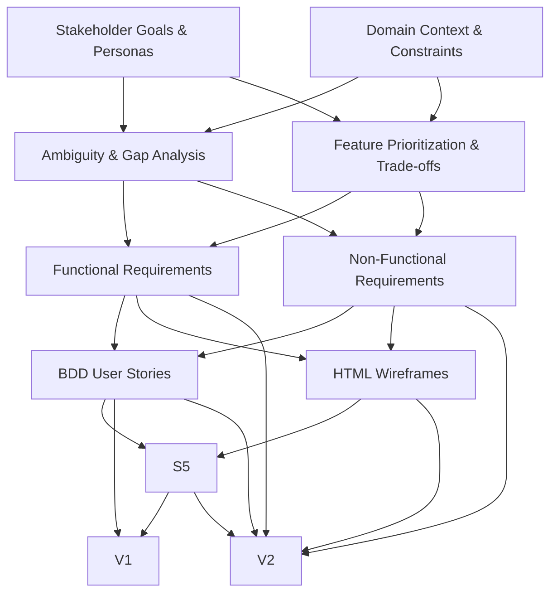

# Requirements Engineering Execution Plan: LiveFootball Mobile App

---

## Overview
This document outlines the systematic Requirements Engineering (RE) execution plan for the LiveFootball mobile app, strictly following the RE process lifecycle: Elicitation, Analysis, Specification, and Validation. Each step is assigned a unique `step_id`, explicit `re_phase`, dependencies, and deliverable categories.

---

## 1. Requirements Elicitation (`ELICITATION`)

### 1.1. Stakeholder Goals & Personas
- **step_id:** E1
- **re_phase:** ELICITATION
- **Dependencies:** None
- **Deliverable:** USER_NEEDS
- **Description:** Extract core stakeholder goals, target user personas, and primary user needs from the raw input.

### 1.2. Domain Context & Constraints
- **step_id:** E2
- **re_phase:** ELICITATION
- **Dependencies:** None
- **Deliverable:** USER_NEEDS
- **Description:** Identify domain context, operational environment, and explicit constraints (e.g., GDPR, offline mode, performance).

---

## 2. Requirements Analysis (`ANALYSIS`)

### 2.1. Ambiguity & Gap Analysis
- **step_id:** A1
- **re_phase:** ANALYSIS
- **Dependencies:** E1, E2
- **Deliverable:** USER_NEEDS
- **Description:** Analyze elicited requirements for ambiguities, missing information, and perform gap analysis across modules.

### 2.2. Feature Prioritization & Trade-offs
- **step_id:** A2
- **re_phase:** ANALYSIS
- **Dependencies:** E1, E2
- **Deliverable:** USER_NEEDS
- **Description:** Prioritize features (High/Medium/Low), identify trade-offs (e.g., performance vs. offline capability).

---

## 3. Requirements Specification (`SPECIFICATION`)

### 3.1. Functional Requirements (FR)
- **step_id:** S1
- **re_phase:** SPECIFICATION
- **Dependencies:** A1, A2
- **Deliverable:** FUNCTIONAL_REQUIREMENTS
- **Description:** Formalize structured functional requirements for all modules and features.

### 3.2. Non-Functional Requirements (NFR)
- **step_id:** S2
- **re_phase:** SPECIFICATION
- **Dependencies:** A1, A2
- **Deliverable:** NON_FUNCTIONAL_REQUIREMENTS
- **Description:** Specify non-functional requirements (performance, scalability, reliability, security, GDPR, offline mode).

### 3.3. BDD User Stories
- **step_id:** S3
- **re_phase:** SPECIFICATION
- **Dependencies:** S1, S2
- **Deliverable:** USER_STORIES
- **Description:** Write BDD-style user stories (Given-When-Then) for all major user interactions.

### 3.4. Interaction Design Wireframes
- **step_id:** S4
- **re_phase:** SPECIFICATION
- **Dependencies:** S1, S2
- **Deliverable:** HTML_WIREFRAMES
- **Description:** Create HTML-based wireframes for key user interface flows and module integration.

### 3.5. Mockup Mapping
- **step_id:** S5
- **re_phase:** SPECIFICATION
- **Dependencies:** S3, S4
- **Deliverable:** MOCKUP_MAPPING
- **Description:** Map user stories to corresponding wireframes to ensure coverage and traceability.

---

## 4. Requirements Validation (`VALIDATION`)

### 4.1. BDD Syntax & Traceability Matrix
- **step_id:** V1
- **re_phase:** VALIDATION
- **Dependencies:** S3, S5
- **Deliverable:** VALIDATION_REPORT
- **Description:** Verify BDD syntax compliance and completeness of the traceability matrix (user stories ↔ wireframes).

### 4.2. Consistency & Quality Review
- **step_id:** V2
- **re_phase:** VALIDATION
- **Dependencies:** S1, S2, S3, S4, S5
- **Deliverable:** VALIDATION_REPORT
- **Description:** Review consistency between requirements, user stories, wireframes, and NFRs. Check adherence to quality standards (GDPR, usability, performance).

---

## Execution Flow Diagram

---

## Deliverable Categories
- **USER_NEEDS:** Stakeholder goals, personas, domain context, constraints, prioritized features
- **FUNCTIONAL_REQUIREMENTS:** Structured functional requirements for all modules
- **NON_FUNCTIONAL_REQUIREMENTS:** Performance, scalability, reliability, security, GDPR, offline mode
- **USER_STORIES:** BDD user stories for all major interactions
- **HTML_WIREFRAMES:** Key UI flows and module integration mockups
- **MOCKUP_MAPPING:** Mapping of user stories to wireframes
- **VALIDATION_REPORT:** Validation of BDD syntax, traceability, consistency, and quality

---

## Notes
- Steps within the same RE phase (e.g., E1 & E2) can be executed in parallel.
- Each step specifies explicit dependencies for rigorous traceability.
- All deliverables are version-controlled and reviewed at each phase transition.

---

## Parallelization & Dependencies
- Steps E1 and E2 can be executed in parallel.
- Steps A1 and A2 depend on completion of E1 and E2 and can be executed in parallel.
- Steps S1 and S2 depend on A1 and A2 and can be executed in parallel.
- Steps S3 and S4 depend on S1 and S2 and can be executed in parallel.
- Step S5 depends on S3 and S4.
- Steps V1 and V2 depend on completion of all specification steps.

---

## Deliverable Categories
- **USER_NEEDS:** Stakeholder goals, user personas, needs, domain context, constraints
- **FUNCTIONAL_REQUIREMENTS:** Structured functional requirements
- **NON_FUNCTIONAL_REQUIREMENTS:** Structured non-functional requirements
- **USER_STORIES:** BDD user stories
- **HTML_WIREFRAMES:** Key UI wireframes (HTML)
- **MOCKUP_MAPPING:** Mapping of user stories to wireframes
- **VALIDATION_REPORT:** Validation results, traceability, compliance

---

## File Naming Convention
- This plan is saved as `00_plan.md` in the workspace.
- All subsequent deliverables will follow the step and deliverable naming convention for traceability.
