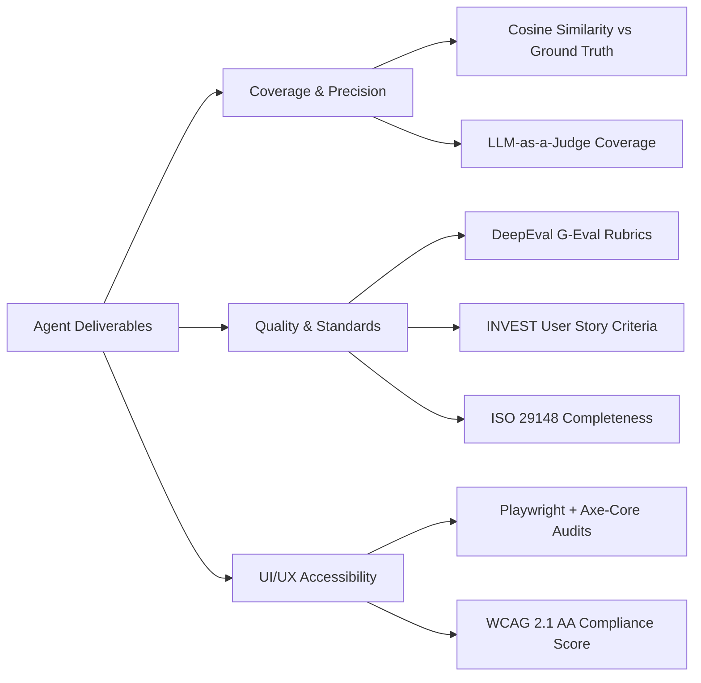

# 🤖 Agentic AI for Automated Requirements Engineering

> **MSc Dissertation Project — Lancaster University**  
> *A comparative evaluation of multi-agent LLM architectures automating the software Requirements Engineering (RE) and Interaction Design (IxD) pipeline from unstructured client briefs.*

[](https://www.python.org/)
[](https://github.com/langchain-ai/langgraph)
[](https://github.com/langchain-ai/langchain)
[](https://azure.microsoft.com/en-us/products/ai-services/openai-service)
[](https://github.com/confident-ai/deepeval)
[](https://playwright.dev/)

---

## 📌 Executive Summary

Translating raw, ambiguous client briefs into formal engineering specifications is one of the most critical and time-consuming phases of software development. 

This project explores whether **Agentic AI systems** can autonomously execute end-to-end Requirements Engineering and Interaction Design. Using **LangGraph** and **Azure OpenAI**, the system ingests unstructured stakeholder vision documents and automatically generates formal, standards-compliant engineering deliverables — from IEEE 830 functional requirements to interactive, accessible HTML5 wireframes.

To determine optimal multi-agent design patterns, this study implements and benchmarks **four distinct agent architectures** across identical datasets and evaluation criteria.

---

## 🏛️ Compared Agent Architectures

| # | Architecture | Pattern | Key Mechanism | Best Suited For |
|---|---|---|---|---|
| **1** | **Single Agent** | ReAct Tool Loop | Autonomous single agent iteratively executes tools to read inputs and compile deliverables. | Rapid baseline prototyping; straightforward briefs. |
| **2** | **Supervisor-Worker** | Hierarchical Routing | A supervisor orchestrates specialised Business Analyst and Interaction Designer workers with iterative quality gates. | Modular task separation with automated oversight. |
| **3** | **Human-in-the-Loop (HITL)** | Multi-Agent Dispatcher | A central dispatcher coordinates 9 specialised subagents, pausing for human elicitation and sign-off checkpoints. | High-ambiguity briefs and enterprise requirements needing stakeholder validation. |
| **4** | **Review-Critique** | Self-Reflection | A generator agent produces deliverables evaluated by an independent critique agent using an elevated model tier in a refinement loop. | High-rigour domains requiring self-correction and hallucination suppression. |

---

## 📦 What the System Generates

Every architecture processes input documents and outputs a complete, production-ready specification package:

- 🎯 **User Needs (`UN-XXX`)**: High-level goals classified by user groups (Overarching, Primary, Secondary) with demand levels.
- 📋 **Functional Requirements (`FR-XXX`)**: IEEE 830-compliant requirements with formal `shall` statements.
- 🛡️ **Non-Functional Requirements (`NFR-XXX`)**: Measurable quality attributes covering performance SLAs, security, GDPR, and scalability.
- 📖 **User Stories (`US-XXX`)**: Agile stories structured as *"As a [role], I want [goal] so that [benefit]"* paired with Gherkin-style `Given-When-Then` acceptance criteria.
- 🔗 **Traceability Matrix & Gap Analysis**: Full cross-linking (`User Needs → FRs/NFRs → User Stories`) highlighting identified specification gaps and recommendations.
- 🎨 **Responsive HTML5 UI Wireframes**: Self-contained CSS Grid mockups showing multi-state layouts (*Populated*, *Empty*, *Error/Offline*).
- 📐 **Interaction Design Rationale**: Story-to-screen mappings and documented UX trade-off decisions.

---

## 📊 Evaluation & Benchmarking

The generated deliverables are scored against ground-truth benchmarks across three rigorous evaluation pillars:



1. **Ground Truth Coverage**: Semantic embedding similarity (`text-embedding-3-small` via scikit-learn) and LLM-as-a-Judge alignment against benchmark datasets.
2. **Quality & Standard Compliance**: Automated evaluation via **DeepEval (G-Eval)** for ISO 29148 requirements quality and INVEST agile story compliance.
3. **Accessibility (WCAG 2.1 AA)**: Headless browser auditing via **Playwright** and **axe-core** to catch color contrast, ARIA, and markup violations in generated UI wireframes.

---

## 🛠️ Tech Stack

- **Agent Orchestration**: [LangGraph](https://github.com/langchain-ai/langgraph), [LangChain](https://github.com/langchain-ai/langchain)
- **Language Models**: Azure OpenAI (`gpt-5.4` generator, `gpt-5.5` critique/evaluator)
- **Vector Database / RAG**: [Pinecone](https://www.pinecone.io/) (`text-embedding-3-small`)
- **Evaluation Framework**: [DeepEval](https://github.com/confident-ai/deepeval), [Playwright](https://playwright.dev/), [axe-core](https://github.com/dequelabs/axe-core), scikit-learn
- **Observability & Tracing**: [LangSmith](https://smith.langchain.com/)
- **Visualisation**: Matplotlib, pandas

---

## 📁 Repository Structure

```
├── single_agent/           # Architecture 1: Single ReAct autonomous agent
├── supervisor_worker/      # Architecture 2: Supervisor-Worker hierarchical pipeline
├── hitl_agent/             # Architecture 3: Human-in-the-Loop with 9 specialised subagents
├── review_critique/        # Architecture 4: Self-Reflection & Critique refinement loop
├── global_layer/           # Shared infrastructure (LLM clients, state models, formatters)
├── evaluation/             # Evaluation suite (G-Eval, Playwright Axe, coverage matrices)
├── Data/                   # Test datasets (LiveFootball, Clean Air Zone, Smart House SRS)
├── tests/                  # Automated unit and integration tests
├── METHODOLOGY.md          # In-depth academic dissertation methodology document
├── requirements.txt        # Pinned dependencies
└── pyproject.toml          # Project configuration
```

---

## 🚀 Quick Start

### 1. Prerequisites & Installation

```bash
# Clone the repository
git clone https://github.com/<your-username>/Agentic-AI.git
cd Agentic-AI

# Create and activate virtual environment
python -m venv .venv
.venv\Scripts\activate      # On Windows
# source .venv/bin/activate # On macOS/Linux

# Install dependencies and local package
pip install -r requirements.txt
pip install -e .
```

### 2. Environment Configuration

Create a `.env` file in the project root:

```env
AZURE_OPENAI_API_KEY="your-azure-key"
AZURE_OPENAI_ENDPOINT="https://your-resource.openai.azure.com/"
AZURE_OPENAI_API_VERSION="2024-07-18"
MODEL="gpt-5.4"
EVAL_MODEL="gpt-5.5"

# Optional: Vector Store & Tracing
PINECONE_API_KEY="your-pinecone-key"
LANGSMITH_API_KEY="your-langsmith-key"
LANGSMITH_TRACING=true
```

### 3. Running an Agent Architecture

Execute any architecture via its CLI runner:

```bash
# 1. Single Agent
python -m single_agent.run --output-dir "final_run" --thread-id "sa_1"

# 2. Supervisor-Worker
python -m supervisor_worker.run --output-dir "final_run"

# 3. Human-in-the-Loop (Interactive prompt in CLI)
python -m hitl_agent.run --output-dir "final_run" --thread-id "dispatcher_1"

# 4. Review-Critique
python -m review_critique.run --output-dir "final_run" --thread-id "rc_1"
```

Outputs will be saved in each architecture's respective `outputs/<run_name>/` folder.

### 4. Running the Evaluation Suite

```bash
# Run comprehensive evaluation on agent outputs
python -m evaluation.run --agent hitl \
    --func-reqs hitl_agent/outputs/final_run/03_functional_requirements.md \
    --nfunc-reqs hitl_agent/outputs/final_run/04_non_functional_requirements.md \
    --user-stories hitl_agent/outputs/final_run/05_user_stories.md \
    --html-dir hitl_agent/outputs/final_run/html

# Run DeepEval G-Eval metrics
python -m evaluation.geval.run_geval --agent hitl
```

---

## 📖 In-Depth Research & Methodology

Looking for the complete academic methodology, prompt engineering strategies, or theoretical derivations?  
👉 See the [Complete Dissertation Methodology Document (METHODOLOGY.md)](METHODOLOGY.md).

---

## 👤 Author

- **Maaz Bin Adnan** — MSc Project, Lancaster University
- GitHub: [@maazbinadnan](https://github.com/maazbinadnan)
