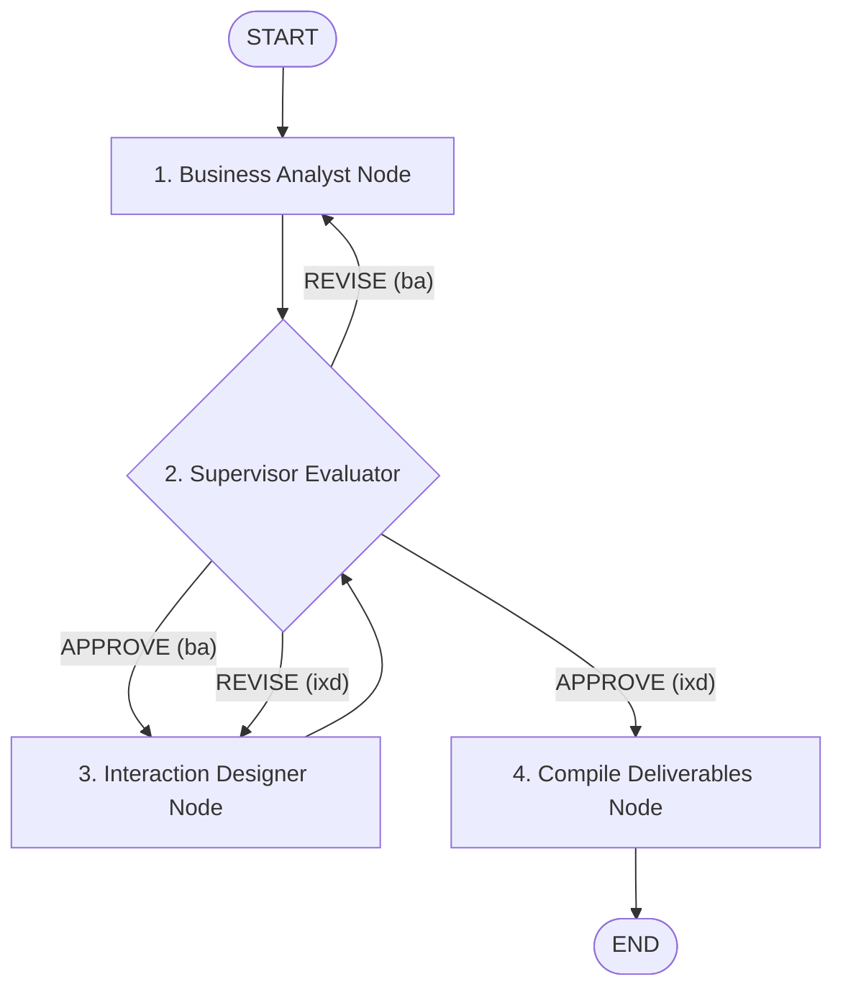

# Supervisor-Worker Multi-Agent System (Requirements Engineering)

The **Supervisor-Worker** module implements a state-of-the-art **Evaluator-Optimizer Multi-Agent Architecture** in LangGraph. It automates the end-to-end Requirements Engineering pipeline—translating raw stakeholder requirement documents into formal Business Analyst (BA) specifications and Interaction Design (IxD) HTML mockups under the rigorous quality oversight of an AI Supervisor Agent.

---

## 📐 System Architecture & Workflow

The architecture separates concerns between **Specialist Worker Agents** (who generate artifacts) and an **Evaluator Supervisor Agent** (who reviews work against domain rubrics, scores quality, and decides whether to approve or demand revisions).



---

## 🧩 Node Breakdown & Component Responsibilities

### 1. Business Analyst Node (`agents/business_analyst.py`)
- **Role**: Dissects raw stakeholder inputs into structured Requirements Engineering specifications.
- **Output Schema**: `RequirementsPipelineOutput` (Pydantic model) containing:
  - High-level **User Needs** (`UN-XXX`)
  - **Functional Requirements** (`FR-XXX`) & **Non-Functional Requirements** (`NFR-XXX`)
  - Agile **User Stories** (`US-XXX`) with Gherkin-style BDD Acceptance Criteria (`Given-When-Then`)
  - **Traceability Matrix** mapping User Needs $\rightarrow$ Requirements $\rightarrow$ User Stories
  - **Gaps & Recommendations** highlighting ambiguous business rules
- **Output Files**: Saved into `01_business_analysis/iter_<n>/` as 5 distinct Markdown documents.

### 2. Interaction Designer Node (`agents/interaction_designer.py`)
- **Role**: Transforms approved BA User Stories into high-fidelity HTML/CSS mockups and UI/UX specifications.
- **Output Schema**: `IxdPipelineOutput` (Pydantic model) containing:
  - Complete, standalone **HTML Mockup Files** for each user journey screen
  - **User Story to Screen Mapping Table**
  - **UI/UX Trade-off Decisions** table
- **Output Files**: Saved into `02_interaction_design/iter_<n>/`.

### 3. Supervisor Node (`agents/supervisor.py`)
- **Role**: Senior Quality Assurance Reviewer executing phase-specific evaluation prompts (`coordinator_ba.md` and `coordinator_ixd.md`).
- **Engine Design**: Uses a **Registry Mapping** (`EVAL_CONFIG`) to dynamically select rubrics based on `state["phase"]`.
- **Output Schema**: `SupervisorReview` (Pydantic model):
  - `verdict`: `"APPROVE"` or `"REVISE"`
  - `score`: Quality rating from 1 to 5
  - `phase`: Target next phase (`"ba"`, `"ixd"`, or `"END"`)
  - `issues`: Array of specific item IDs violating guidelines
  - `feedback`: Actionable guidance for worker revision

### 4. Router (`agents/routing.py`)
- **Role**: Deterministic graph conditional edge controller (no LLM latency).
- **Decision Logic**:
  1. **Safety Valve**: Checks `state["iterations"][phase] >= state["max_iterations_per_phase"]`. Forces forward if max revision limit is hit.
  2. **Phase Routing**:
     - `phase == "ba"` & `verdict == "REVISE"` $\rightarrow$ `"business_analyst"`
     - `phase == "ba"` & `verdict == "APPROVE"` $\rightarrow$ `"interaction_designer"`
     - `phase == "ixd"` & `verdict == "REVISE"` $\rightarrow$ `"interaction_designer"`
     - `phase == "ixd"` & `verdict == "APPROVE"` / `"END"` $\rightarrow$ `"compile_deliverables"`

### 5. Deliverables Compiler (`agents/compile_deliverables.py`)
- **Role**: Aggregates final approved BA specifications and IxD HTML mockups.
- **Output**: Exports `INDEX.md` and compiled HTML mockups into `final_deliverables/`.

---

## 📂 Output Folder Organization

Session outputs are saved under a timestamped directory inside `outputs/`, maintaining a complete non-destructive iteration history:

```
supervisor_worker/outputs/<session_name>/
├── 01_business_analysis/
│   ├── iter_0/                      <-- BA Initial Output
│   │   ├── 01_user_needs.md
│   │   ├── 02_functional_requirements.md
│   │   ├── 03_non_functional_requirements.md
│   │   ├── 04_user_stories.md
│   │   ├── 05_analysis_summary.md
│   │   └── supervisor_review.md      <-- Supervisor Review for Iteration 0
│   └── iter_1/                      <-- BA Revision 1 (if requested)
│       └── ...
├── 02_interaction_design/
│   ├── iter_0/                      <-- IxD Initial Output
│   │   ├── mockups.html
│   │   ├── mapping_table.md
│   │   ├── tradeoffs.md
│   │   └── supervisor_review.md      <-- Supervisor Review for Iteration 0
│   └── iter_1/                      <-- IxD Revision 1 (if requested)
│       └── ...
├── final_deliverables/               <-- Master Approved Package
│   ├── INDEX.md
│   └── mockups/
└── state.json                        <-- Full graph execution state dump
```

---

## 💾 State Contracts (`local_states/_state_.py` & `supervisor_state.py`)

### `AgentState` Schema

```python
class AgentState(TypedDict):
    messages: Annotated[List[AnyMessage], operator.add]
    input: str                         # Raw input requirements document text
    output_dir: str                    # Target root output directory
    phase: Literal["ba", "ixd", "completed", "END"] # Active pipeline phase
    ba_output: Optional[dict]          # Dumped RequirementsPipelineOutput Pydantic model
    ixd_output: Optional[dict]         # Dumped IxdPipelineOutput Pydantic model
    supervisor_feedback: Optional[str] # Actionable review string for active revision
    feedback_history: List[dict]       # Cumulative log of all supervisor evaluations
    iterations: Dict[str, int]        # Independent counters: {"ba": 0, "ixd": 0}
    max_iterations_per_phase: int      # Limit safety valve (default: 3)
    verdict: Optional[str]             # "APPROVE" | "REVISE"
```

---

## 🚀 Quickstart & Execution Guide

### Prerequisites
1. Ensure your `.env` file at the root contains your LLM credentials (e.g. `GOOGLE_API_KEY` or `OPENAI_API_KEY`).
2. Verify dependencies are installed (`langgraph`, `langchain`, `pydantic`, `python-dotenv`).

### Running the System

```bash
# 1. Run via module with default output folder
python -m supervisor_worker.run

# 2. Run with a custom output session name
python -m supervisor_worker.run --output-dir "full_test_run"

# 3. Generate or view the visual graph diagram (graph.png)
python supervisor_worker/main.py
```

---

## ⚙️ Configuration (`config.json`)

The module uses relative pathing resolved automatically against the file location:

```json
{
    "prompts_dir": "prompts",
    "state_dir": "states"
}
```

Prompts are cached in memory using `@functools.lru_cache` to minimize disk I/O during multi-iteration loops.
